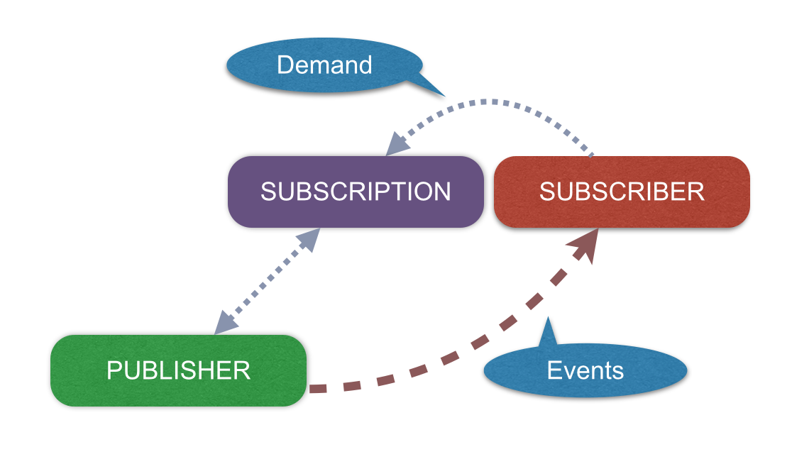

# 토비의 봄 TV 5회

RFP
- 외부에 이벤트가 발생을 하면 거기에 대응하는 프로그래밍을 작성.

Observer Pattern

Reactive Streams
- Java9 API

Duality
- Iterable: Pull
- Observable: Push

Iterable
```java
public interface Collection<E> extends Iterable<E> {
    
}

public interface List<E> extends Collection<E> {
    
}

// Duality
// Iterable <--> Observable

Iterable<Integer> iter = Arrays.asList(1, 2, 3, 4, 5);
for(Integer i : iter) { // for-each
    System.out.println(i);
}

// iterator() implement
Iterable<Integer> iter = () ->
    new Iterator<Integer>() {
        int i = 0;
        final static int MAX = 10;
        @Override
        public boolean hasNext() {
            return i < MAX;
        }

        @Override
        public Integer next() {
            return ++i;
        }
    };

for(Integer i : iter) {
    System.out.println(i);
}
```

Observable
```java
//publisher
@Deprecated(since="9")
public class Observable {
        public synchronized void addObserver(Observer o) {}
        protected synchronized void setChanged() {}
        public void notifyObservers(Object arg) {}
}

// subscriber
@Deprecated(since="9")
public interface Observer {
    void update(Observable o, Object arg);
}

```

옵저버 패턴의 문제점
- Complate(완료) 개념이 없다.
- Error(예외) 처리가 모던하지 않음.

참고 
- http://www.reactive-streams.org
- http://reactivex.io
- https://github.com/ReactiveX/RxJava


기존의 옵저버 패턴과 유사함.

* Publisher : 발행자
* Subscriber : 구독자



Publisher에 Subscriber를 등록하면 Publisher는 Subscription을 생성하여 Subscriber.onSubscribe() 메서드를 호출함.
Publisher.subscribe(Subscriber)


onSubscriber onNext* (onError | onComplete)?

#### 주요 인터페이스 

```java
@FunctionalInterface
public static interface Publisher<T> {

    public void subscribe(Subscriber<? super T> subscriber);
}

public static interface Subscriber<T> {

    public void onSubscribe(Subscription subscription);

    public void onNext(T item);

    public void onError(Throwable throwable);

    public void onComplete();
}

public static interface Subscription {

    public void request(long n);

    public void cancel();
}
```

